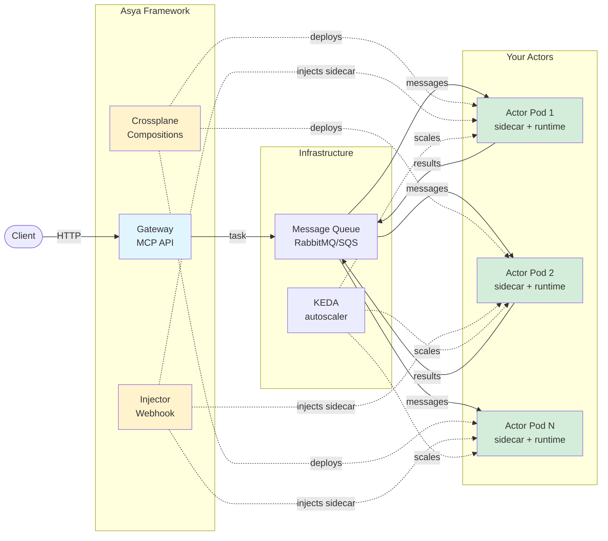

# Architecture Overview

Asya🎭 is a Kubernetes-native async actor framework with pluggable components for AI/ML orchestration.

## System Architecture

## Core Components

### Framework Components

- **[Crossplane Compositions](asya-crossplane.md)**: Declarative infrastructure compositions that create AsyncActor workloads, queues, and KEDA autoscaling
- **[Injector](asya-injector.md)**: Mutating webhook that injects asya-sidecar and asya-runtime into actor pods
- **[Gateway](asya-gateway.md)**: Optional MCP HTTP API for task submission, SSE streaming, and status tracking
- **[CLI](asya-cli.md)**: Command-line tool for interacting with the gateway (MCP client)

### Actor Components

Each actor pod contains two containers:

- **[Sidecar](asya-sidecar.md)**: Handles queue consumption, message routing, retries, progress reporting (Go)
- **[Runtime](asya-runtime.md)**: Executes your Python handler via Unix socket, handles OOM recovery

### System Actors

- **[Crew Actors](asya-crew.md)**: Special actors with reserved roles (`x-sink`, `x-sump`) for result persistence and error handling

### Infrastructure

- **[Message Queue](transports/README.md)**: Pluggable transports (SQS, RabbitMQ, Kafka/NATS planned)
- **[KEDA](autoscaling.md)**: Monitors queue depth, scales actors 0→N based on workload
- **[Observability](observability.md)**: Prometheus metrics, structured logging, OpenTelemetry integration

## Message Flow

1. **Client** sends request to Gateway (or directly to queue)
2. **Gateway** creates task, routes to first actor's queue
3. **Sidecar** consumes message from queue
4. **Sidecar** forwards message to Runtime via Unix socket
5. **Runtime** executes your Python handler, returns result
6. **Sidecar** routes result to next actor's queue (or `x-sink`/`x-sump`)
7. Repeat steps 3-6 for each actor in the route
8. **Crew actor** (`x-sink` or `x-sump`) persists final result, reports status to gateway

**Key insight**: `Queue → Sidecar → Your Code → Sidecar → Next Queue`

## Actor Lifecycle

1. User creates AsyncActor CRD
2. Crossplane Composition reconciles:
   - Creates queue (`asya-{namespace}-{actor_name}`)
   - Creates Deployment
   - Creates KEDA ScaledObject (if scaling enabled)
3. Injector webhook mutates pod spec:
   - Injects sidecar container
   - Injects runtime entrypoint and ConfigMap
4. KEDA monitors queue depth, scales pods 0→N
5. Sidecar consumes messages, routes to runtime
6. Runtime executes handler, returns results
7. Sidecar routes results to next queue

## Protocols

- **[Actor-to-Actor](protocols/actor-actor.md)**: Message structure, routing, status tracking
- **[Sidecar-Runtime](protocols/sidecar-runtime.md)**: Unix socket communication, framing protocol, error handling

## Component Details

- **[AsyncActor CRD](asya-actor.md)**: Workload specification, scaling configuration, timeout settings
- **[Autoscaling](autoscaling.md)**: KEDA integration, scaling strategies, queue-based autoscaling
- **[Observability](observability.md)**: Metrics, logging, tracing, monitoring best practices

## Deployment Patterns

**AWS (SQS + S3)**:

- Crossplane creates SQS queues via AWS Provider
- Actors use IAM roles (IRSA/Pod Identity) for queue access
- Results stored in S3
- KEDA uses CloudWatch metrics

**Self-hosted (RabbitMQ + MinIO)**:

- Crossplane creates RabbitMQ queues via custom provider
- Actors use username/password from secrets
- Results stored in MinIO (S3-compatible)
- KEDA uses RabbitMQ API

**See**: Installation Guides ([AWS EKS](../install/aws-eks.md), [Local Kind](../install/local-kind.md)) for detailed deployment instructions.
